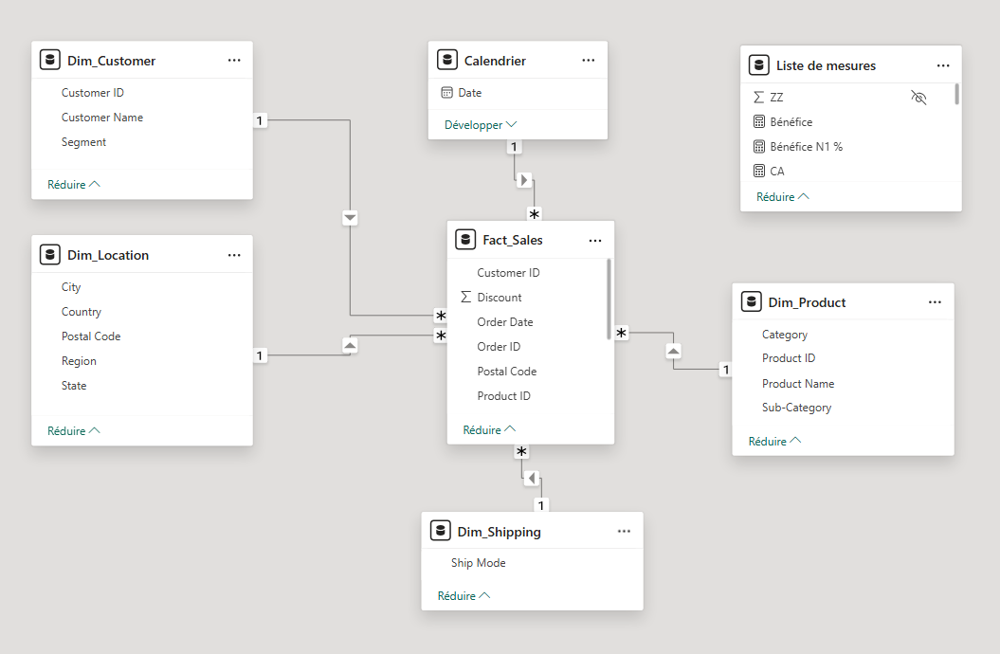
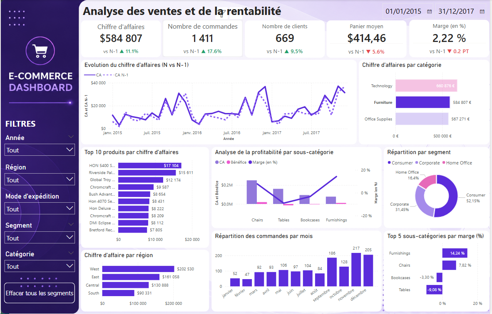

# 🛒 E-Commerce Dashboard — Power BI

## 📊 Présentation

Ce projet consiste à analyser la performance commerciale d'une entreprise e-commerce à travers un **dashboard Power BI interactif**.

L'objectif est de transformer les données de ventes en **indicateurs de pilotage et insights exploitables**, afin d'identifier les principaux leviers de chiffre d'affaires, de rentabilité et de performance commerciale.

---

## 🎯 Problématique

L'analyse cherche notamment à répondre aux questions suivantes :

- Comment évolue le chiffre d'affaires dans le temps ?
- Quelles catégories génèrent le plus de revenus ?
- Quels produits sont les plus performants ?
- Quels segments clients contribuent le plus au chiffre d'affaires ?
- Quelles catégories présentent les meilleures marges ?
- Comment évoluent les principaux KPI par rapport à N-1 ?
- Quelles zones géographiques concentrent les meilleures performances ?

---

## 🛠️ Technologies

- **Power BI**
- **DAX**
- **Power Query**
- **Modélisation dimensionnelle**
- **Star Schema**

---

## 🧱 Modélisation & Architecture

Le projet repose sur une **architecture en étoile (Star Schema)** afin de structurer les données et de faciliter leur analyse dans Power BI.



### 🔄 Flux de traitement

Les données suivent un flux structuré depuis leur source jusqu'à leur restitution :

```text
Sources de données
        ↓
Power Query
        ↓
Nettoyage & transformation
        ↓
Modèle en étoile
        ↓
Mesures DAX
        ↓
Dashboard Power BI
        ↓
Analyse & Insights
```

Cette approche permet de séparer les différentes étapes de préparation, de modélisation et d'analyse des données, tout en facilitant la maintenance et l'évolution du modèle.

---

## 📈 Dashboard



### Principaux indicateurs

- **Chiffre d'affaires**
- **Nombre de commandes**
- **Nombre de clients**
- **Panier moyen**
- **Marge %**
- **Évolution du CA vs N-1**
- **Performance des catégories et produits**
- **Performance géographique**

---

## 🧮 DAX

Les principales mesures DAX utilisées dans le dashboard permettent de calculer les KPI commerciaux, les indicateurs de rentabilité ainsi que les évolutions par rapport à N-1.

La documentation complète des mesures est disponible dans [**Mesures DAX**](Mesures/README_Mesures_DAX.md).

---

## 📂 Données

### Source

**Superstore Dataset — Kaggle**

[Voir le dataset sur Kaggle](https://www.kaggle.com/datasets/vivek468/superstore-dataset-final)

Le dataset contient notamment des informations relatives aux :

- commandes ;
- clients ;
- produits ;
- catégories ;
- ventes ;
- bénéfices ;
- régions et zones géographiques ;
- modes d'expédition.

---

## 💡 Insights

Le dashboard permet d'identifier les principales tendances et leviers de performance à travers l'analyse du chiffre d'affaires, de la rentabilité, des commandes et du comportement client.

Les principaux axes d'analyse portent notamment sur :

- **L'évolution des KPI** par rapport à l'année précédente ;
- **La performance commerciale** à travers le chiffre d'affaires et le bénéfice ;
- **Le comportement d'achat** à travers le panier moyen et le volume de commandes ;
- **La dynamique client** et la contribution des différents segments ;
- **La performance des catégories et produits** ;
- **Les écarts de performance entre les différentes zones géographiques** ;
- **L'identification des variations et points d'attention** nécessitant une analyse approfondie.

Les indicateurs et visualisations permettent ainsi de transformer les données en **insights exploitables pour orienter le pilotage de la performance commerciale**.

---

## 📐 Documentation

Le projet comprend également une documentation dédiée aux principaux éléments techniques :

- [📊 Modèle de données](Data_Model/Data_Model.PNG)
- [🧮 Mesures DAX](Mesures/README_Mesures_DAX.md)
- [📈 Dashboard Power BI](Dashboard/Dashboard.PNG)

---

## 👤 Auteur

**Ahmed Zouaghi**

Master 2 SIAD — Business Intelligence  
Université de Lille
